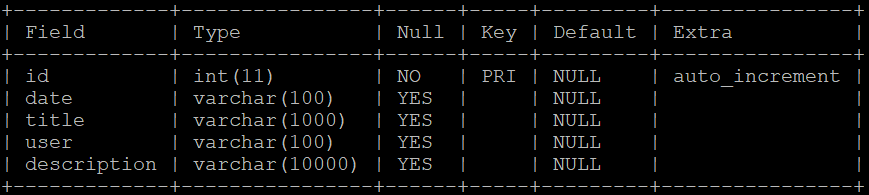

# SimpleNotification
Notification app  with AWS   
# ScreenShots  
    
# DB Structure   
   

# Todo    
Implement notification bar
Manage Client Notification Data by Room-database(SQL)   
        ->Maybe room is more effective?
