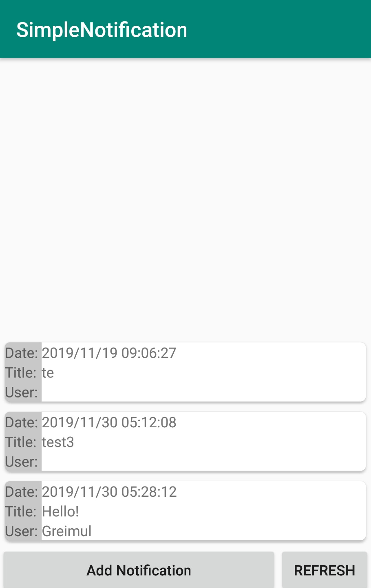
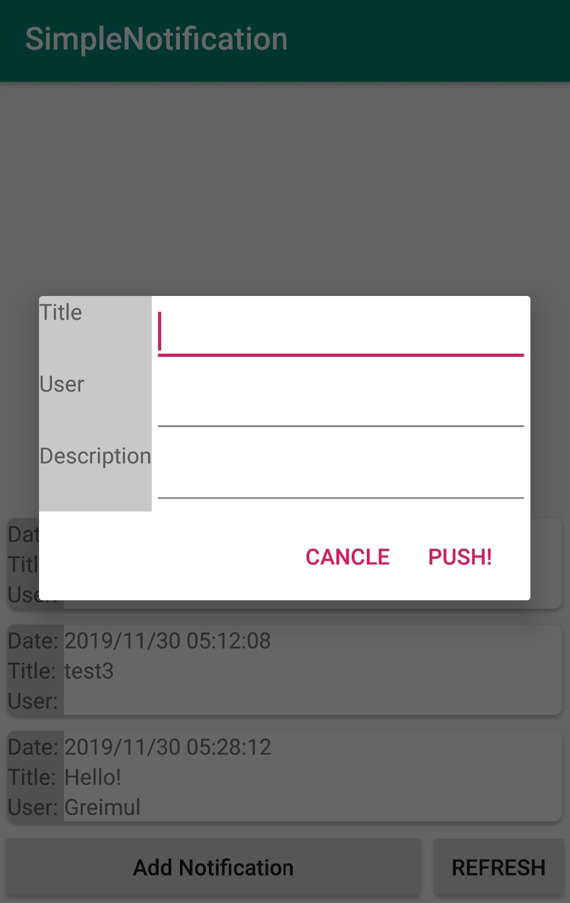
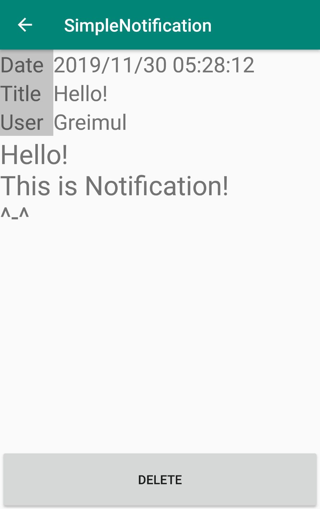

kotlin, php, retrofit2, AWS, MySql, Service    

# SimpleNotification    
Notification app with AWS   
   
# Description   
Push notification to server.
Delete notification from server.

Check new notification from server periodically at background(Service).
If there is new notification at server, show status bar.

# ScreenShots  
    
   

# DB Structure   
   

# Todo    
Update php code   
Refactoring code   
Manage Client Notification Data by Room-database(SQL)   
        ->Maybe room is more effective?
